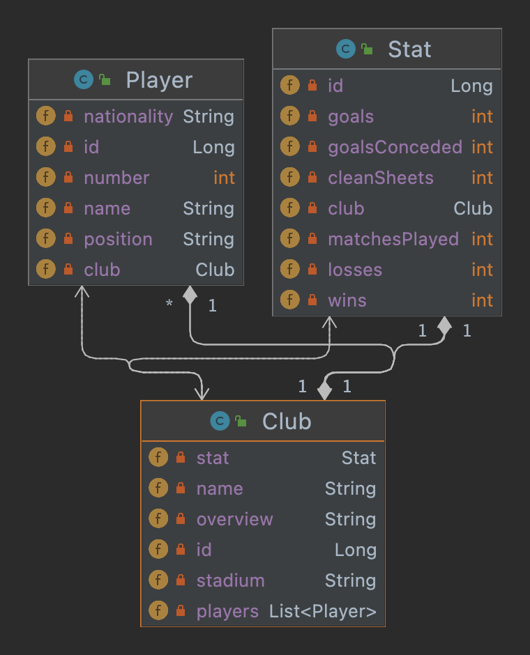

# Premier League Web Scraper
## Table of contents

* ### [ About application ](#about-application)
* ### [ How to run ](#how-to-run)
    * ### [ JAR file ](#jar-file)
    * ### [ Docker ](#docker)
* ### [ UML class diagram](#uml)
* ### [ Endpoints ](#endpoints)
* ### [ Configuration ](#configuration)
* ### [ Helper tools ](#helper-tools)

<a name="about-application"></a>
## About application

The idea was to build some basic web scraping application using [Premier League](https://www.premierleague.com/) site.
It was made using **Spring Boot**, **Spring Data JPA**, **Spring Data REST** and **Docker**. Database is in memory **H2**.

<a name="how-to-run"></a>
## How to run
There are several ways to run the application.

<a name="jar-file"></a>
## Run JAR file

You can build the JAR file with:
```bash
./gradlew clean build
``` 
Then you can run the JAR file:
```bash
java -jar build/libs/premier-league-web-scraper-0.0.1-SNAPSHOT.jar
``` 
<a name="docker"></a>
## Docker

It is possible to run web-scraper using Docker:
Build Docker image:
```bash
podman build -t web-scraper.jar .    
``` 
Next command shows all images:

```bash
podman images    
``` 
After you find image id you can run image:

```bash
podman run -p 8080:8080 image id  
``` 
<a name="uml"></a>
## UML class diagram

<p align="center">

</p>

<a name="endpoints"></a>
## Endpoints

| **Endpoints**                                   | **Description**                | **Method** |
|:------------------------------------------------|:-------------------------------|:----------:|
| `http://localhost:8080/data/clubs`              | Get all premier league clubs   |    GET     | 
| `http://localhost:8080/data/clubs/{id}`         | Get info about specific club   |    GET     |
| `http://localhost:8080/data/clubs/{id}/players` | Get all club players           |    GET     | 
| `http://localhost:8080/data/clubs/{id}/stats`   | Get stats for specific club    |    GET     |
| `http://localhost:8080/data/players`            | Get all premier league players |    GET     |
| `http://localhost:8080/data/players/{id}`       | Get info about specific player |    GET     |

<a name="configuration"></a>
## Configuration
### Environment variables

| **Variable**               | **Description**                | **Default Value**                                             |
|:---------------------------|:-------------------------------|---------------------------------------------------------------|
| PREMIER_LEAGUE_URL         | Premier league site            | https://www.premierleague.com/                                |

<a name="helper-tools"></a>
## Helper tools
### H2 Database web interface

Go to the web browser and visit `http://localhost:8080/h2-console`
In field **JDBC URL** put
```
jdbc:h2:mem:premier_league_web_scraper
```
In `/src/main/resources/application.yaml` file it is possible to change both web interface url path, as well as the datasource url.